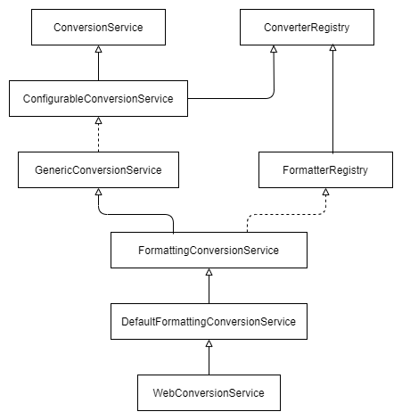

# Data Binding

```
@Controller
public Class ArticleController {
  @GetMapping("/article/{id}")
  public String test(@PathVariable Article article) {
    return article.getId();
  }
}
```

```
public class Article {
  private String id;
  private String content;
  
  public Article() {}
  
  public Article(String id) {
  	this.id = id;
  }
}
```

"/article/1"로 요청을 할 경우, Article로 변환을 할 수 없어 에러가 발생한다.

## PropertyEditor

DataBinder는 PropertyEditor 인터페이스를 사용하여 데이터 바인딩 작업을 수행한다.

이 인터페이스의 역할은 String 값을 Object로 변환하는 것이다.

스프링이 기본적으로 제공하는 PropertyEditor는 [링크](https://docs.spring.io/spring-framework/docs/current/javadoc-api/org/springframework/beans/propertyeditors/package-summary.html)를 참고한다.

커스텀한 PropertyEditor를 만들고 싶다면 PropertyEditorSupport를 상속받아 필요한 메서드를 재정의한다.

```
public class ArticlePropertyEditor extends PropertyEditorSupport {

    @Override
    public void setAsText(String id) throws IllegalArgumentException {
        this.setValue(new Article(id));
    }
}
```

```
@Controller
public Class ArticleController {
  @InitBinder
  public void init(DataBinder dataBinder) {
  	dataBinder.registerCustomEditor(Article.class, new ArticlePropertyEditor());
  }

  @GetMapping("/article/{id}")
  public String test(@PathVariable Article article) {
    return article.getId();
  }
}
```

initBinder 메서드는 컨트롤러 내의 모든 메서드에 @RequestParam, @PathVariable, @CookieValue, @RequestHeader, @ModelAttribute 파라미터를 바인딩 하기 전에 호출된다.

initBinder 메서드가 파라미터를 바인딩 할 때마다 호출되어 그 때마다 PropertyEditor 객체를 생성한다.

그러나 PropertyEditor는 Statefull하기 때문에 싱글톤 객체로 만들어 사용할 수 없다는 단점이 있다.

## Converter

스프링 3.0부터 사용하는 인터페이스이다.

PropertyEditor와 다르게 Thread Safe하다.

```
public class ArticleConverter implements Converter<String, Article> {
  @Override
  public Article convert(String id) {
  	return new Article(id);
  }
}
```

ConversionService는 데이터 바인딩 작업을 수행한다.

Spring Boot는 WebConversionService를 사용한다.


```
@Configuration
public class WebMvcConfig implements WebMvcConfigurer {
  @Override
  public void addFormatters(FormatterRegistry registry) {
    registry.addConverter(new ArticleConverter());
  }
  
// Spring Boot는 bean으로 등록하기만 해도 된다.
// WebConversionService는 Converter와 Formatter를 자동으로 등록해준다.
//  @Bean
//  public Converter<String, Article> articleConverter() {
//    return new ArticleConverter();
//  }
}
```

## Formatter

Formatter는 PropertyEditor와 같은 역할에 locale 정보를 사용할 수 있다.

PropertyEditor와 다르게 Thread Safe하다.

```
public class ArticleFormatter implements Formatter<Article> {
  @Override
  public Article parse(String id, Locale locale) throws ParseException {
  	return new Article(id);
  }
  
  @Override
  public String print(Article article, Locale locale) {
    return article.getId();
  }
}
```

```
@Configuration
public class WebMvcConfig implements WebMvcConfigurer {
  @Override
  public void addFormatters(FormatterRegistry registry) {
    registry.addConverter(new ArticleFormatter());
  }
  
// Spring Boot는 bean으로 등록하기만 해도 된다.
// WebConversionService는 Converter와 Formatter를 자동으로 등록해준다.
//  @Bean
//  public Formatter<Article> articleFormatter() {
//    return new ArticleFormatter();
//  }
}
```
